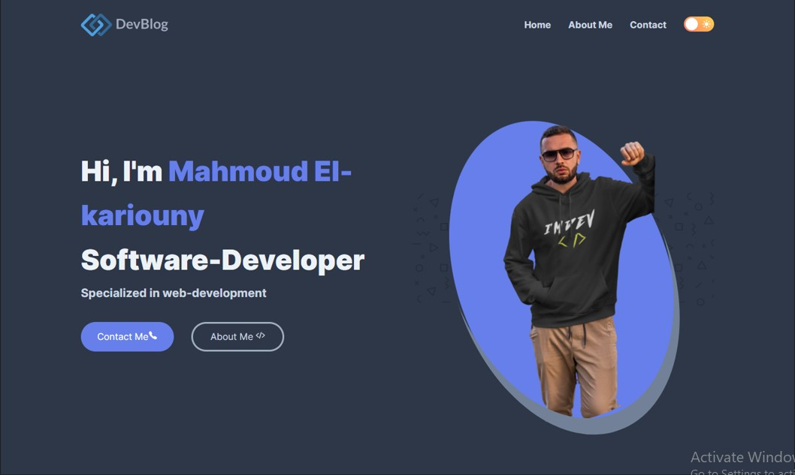
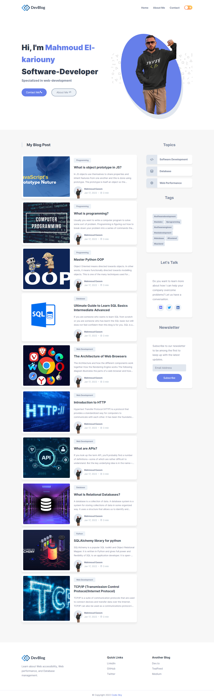

# My-Blog 📰

## Introduction 🗞

Blogging is a great way to communicate with friends, family, and the world at large.

Blogging is the process of writing a personal weblog, or blog, as an online diary.

<div align="center">
  
  <h2 align="center">My-Blog 📰</h2>

My-Blog is a fully responsive blog website, <br />Responsive for all devices, build using Vue.js.

<a href="https://half-mark.surge.sh/"><strong>➥ Live Demo</strong></a>

</div>

<br />

### Demo Screeshots



## Tech Stack (Dependencies)

### Frontend Dependencies

You must have the **HTML**, **CSS**, **Vue.js** for our website's frontend.

- Project setup

```
npm install
```

- Compiles and hot-reloads for development

```
npm run serve
```

- Compiles and minifies for production

```
npm run build
```

- Lints and fixes files

```
npm run lint
```

### Customize configuration

See [Configuration Reference](https://cli.vuejs.org/config/).

## Tech Stack

**Client:** HTML, CSS, Vue.js

## 🛠 Skills

HTML, CSS, Javascript, Vue.js

## Author

- [@mahmoudessam820](https://github.com/mahmoudessam820)

## 🔗 Links

[](https://www.linkedin.com/in/mahmoud-el-kariouny-822719149/)
[](https://twitter.com/Mahmoud42275)

## Feedback

If you have any feedback, please reach out to us at mahmoudelkaruony220@gmail.com 📧

## Screenshots

### Home page


